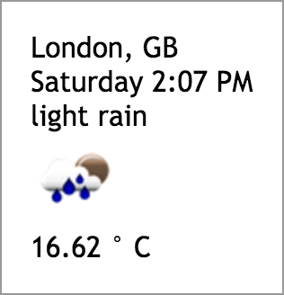

# react-open-weather-map

Yet another **React Weather** component based on [OpenWeatherMap's API](http://openweathermap.org/current)



## Usage

Npm install using the following command:

```
npm i react-open-weather-map
```

And use it inside your **React** app:

```javascript
import OpenWeatherMap from 'react-open-weather-map';

const props = { data: sample }; // info: sample is the response object from the OpenWeatherMap's API

<OpenWeatherMap {...props} />
```

Data sample:

```json
{
  "weather": {
    "coord": {
      "lon": -0.13,
      "lat": 51.51
    },
    "weather": [
      {
        "id": 500,
        "main": "Rain",
        "description": "light rain",
        "icon": "10n"
      }
    ],
    "base": "cmc stations",
    "main": {
      "temp": 16.62,
      "pressure": 1013,
      "humidity": 88,
      "temp_min": 15,
      "temp_max": 18.5
    },
    "wind": {
      "speed": 3.6,
      "deg": 250
    },
    "rain": {
      "3h": 0.215
    },
    "clouds": {
      "all": 32
    },
    "dt": 1473541622,
    "sys": {
      "type": 1,
      "id": 5091,
      "message": 0.0107,
      "country": "GB",
      "sunrise": 1473485363,
      "sunset": 1473531820
    },
    "id": 2643743,
    "name": "London",
    "cod": 200
  }
}
```

## Config

The component accepts a config object that can be used in order to specify:

name | type | default | description
--- | --- | --- | ---
containerClassName | string | 'react-open-weather-map' | the container class name

```javascript
import OpenWeatherMap from 'react-open-weather-map';

const config = { containerClassName: 'open-weather-map-container-class-name' };

<OpenWeatherMap config={config} />
```

## Example

Clone or download this GitHub repository then run the example app using the following npm  commands:

```
npm i
npm run example
```
